# Housing Price Lab - Architecture Diagram

```mermaid
graph TB
    Browser["🖥️ Web Browser"]
    
    subgraph Next["Next.js App"]
        Pages["Pages<br/>Home, Results"]
        Components["Components<br/>Search, Chart, Cards"]
        API["API Routes<br/>/api/houses"]
    end
    
    subgraph Data["Data Layer"]
        JSON["Dummy JSON<br/>or"]
        DB["PostgreSQL<br/>+ Drizzle ORM"]
    end
    
    subgraph Tools["Tools & Libraries"]
        ECharts["ECharts"]
        Tailwind["Tailwind CSS"]
    end
    
    Infra["☁️ Docker + Cloud Run"]
    
    Browser -->|Interact| Pages
    Pages --> Components
    Components -->|Fetch| API
    API --> JSON
    API --> DB
    Components -->|Render| ECharts
    Components -->|Style| Tailwind
    Next -->|Deploy to| Infra
```

## Overview

The Housing Price Lab is a Next.js-based web application for analyzing housing prices with filtering and visualization capabilities.

## Architecture Components

### Frontend
- **Pages**: Home and Results pages that serve as entry points
- **Components**: Reusable React components for search, charts, and summary cards
- **Styling**: Tailwind CSS for responsive design

### Backend
- **API Routes**: Next.js API endpoint at `/api/houses` that handles filtering and data retrieval
- **Data Flexibility**: Can use either static JSON data or PostgreSQL database

### Data Layer
- **Option 1**: Dummy JSON data for development/testing
- **Option 2**: PostgreSQL database with Drizzle ORM for production

### External Libraries
- **ECharts**: Interactive data visualization
- **Tailwind CSS**: Utility-first CSS framework

### Infrastructure
- **Docker**: Containerization for deployment
- **Google Cloud Run**: Serverless compute platform
