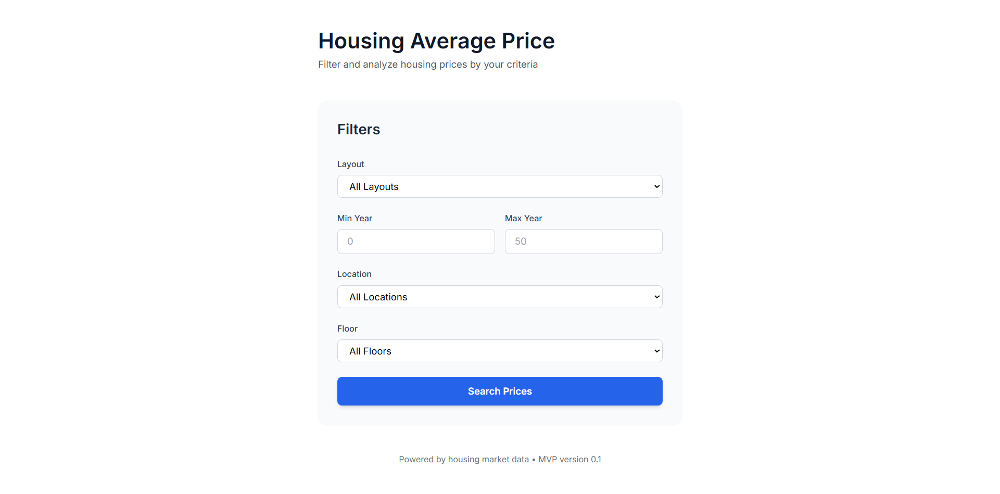
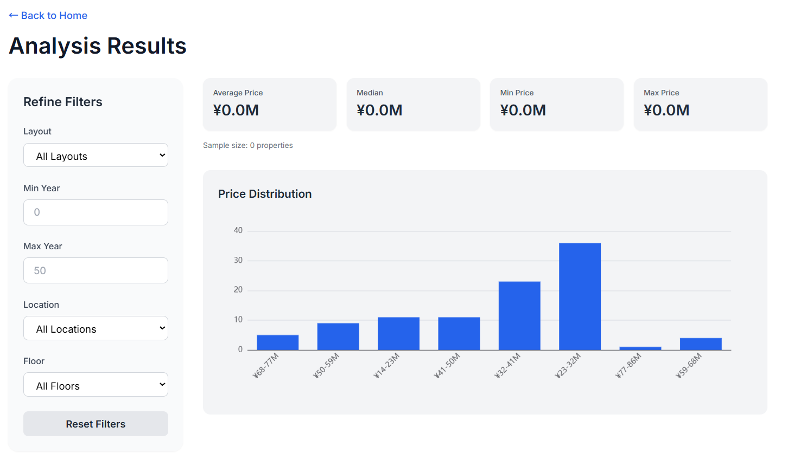

# Housing Price Lab

A full‑stack web application that visualizes housing price trends using modern web technologies.  
This project demonstrates end‑to‑end skills across frontend development, backend integration, cloud infrastructure, and automated deployment.

Live Demo:  
<a href="https://autovalue-insight-2w7oequsua-an.a.run.app/" target="_blank">https://autovalue-insight-2w7oequsua-an.a.run.app/</a>


## 🚀 Features

- Interactive housing price dashboard  
- Prefecture‑level and city‑level filtering  
- Dynamic charts and data visualization  
- Responsive UI optimized for desktop and mobile  
- API‑driven architecture  
- Fully automated cloud deployment using Terraform + Google Cloud Platform


## 🛠 Tech Stack

### **Frontend**
- Next.js 14 (App Router)
- React
- TypeScript
- Tailwind CSS
- EChart

### **Infrastructure / DevOps**
- Terraform (Infrastructure as Code)
- Google Cloud Run
- Google Artifact Registry
- Google Cloud Build
- Google Cloud Storage
- CI/CD pipeline

---

## 🧱 Architecture Overview
User → Next.js App → API Layer → Housing Price Dataset
↓
Deployed via Terraform → GCP (Cloud Run)


This setup ensures:
- Reproducible infrastructure  
- Fast, scalable deployment  
- Low‑maintenance hosting  
- Clear separation between frontend, backend, and infrastructure

---

## 🌐 Live Deployment

The application is deployed on **Google Cloud Run** using **Terraform** for full reproducibility.

- **Frontend**: Next.js app containerized and deployed to Cloud Run  
- **Infrastructure**: Managed entirely via Terraform  
- **Build & Deploy**: Automated through Cloud Build triggers  

This mirrors a production‑ready workflow used in modern SaaS applications.

---

## 📂 Project Structure
```
housing-price-lab/
├── app/                # Next.js app router pages
├── components/         # UI components
├── lib/                # Data utilities
├── public/             # Static assets
├── terraform/          # IaC for GCP deployment
└── Dockerfile          # Container build
```

## 📊 Screenshots





## 🧪 Local Development

```bash
npm install
npm run dev
```

App runs at:
http://localhost:3000

## ☁️ Deployment (Terraform + GCP)
1. 	Authenticate with GCP
2. 	Configure project ID and region
3. 	Deploy infrastructure:

4. 	Build and deploy the container:


🎯 What This Project Demonstrates
This repository showcases capabilities relevant to real‑world SaaS and dashboard development:
• 	Full‑stack web application development
• 	Modern React / Next.js architecture
• 	Data visualization and dashboard UI
• 	Cloud‑native deployment
• 	Infrastructure as Code (Terraform)
• 	CI/CD automation
• 	Production‑ready containerized workflow
If you're looking for a developer who can build dashboards, admin panels, analytics tools, or cloud‑deployed web apps, this project reflects that skill set.

📬 Contact
If you’d like to collaborate or need a custom dashboard / web application:

Email: yoshiyuki.takahashi.jp@gmail.com

GitHub: https://github.com/y16i

